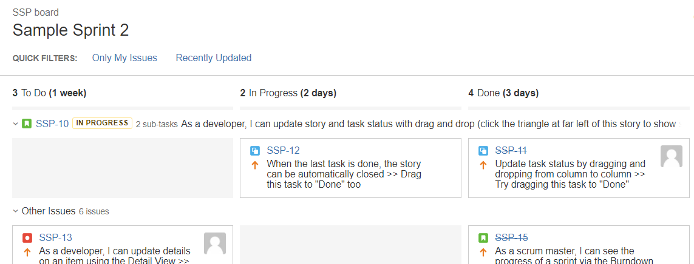

# ELM Asset Lirary

## Overview.

This plugin contains 2 modules 

Module 1: 

The time duration to the right of the status is added by this plugin.

With a small amount of work, it could be made to show any field that can sensibly be "summed up", eg remaining estimate, time spent, or a _Number_ custom field.

Module 2:

There are library asset to support centerilization 

## Installation

Install like any other plugin. You will require a recent version of ScriptRunner.

## Development

See https://bitbucket.elm.sa/projects/ATLS/repos/elm-library-quack/

    mvn jira:debug

or

    atlas-run

If you are modifying the javascript change run `mvn jira:debug "-Ddev.mode=true"` to enable dev mode.

If you change the REST endpoint run `mvn package` to rebuild. _Quick reload_ will install the plugin.

